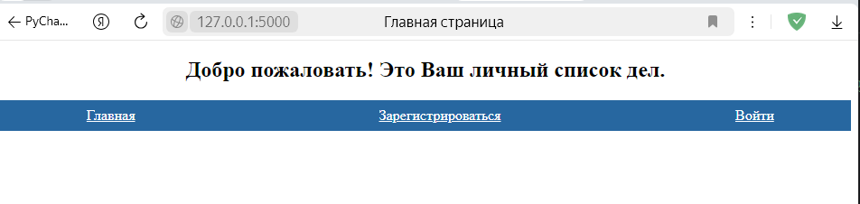
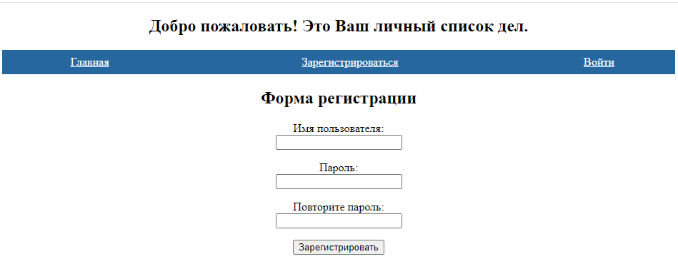
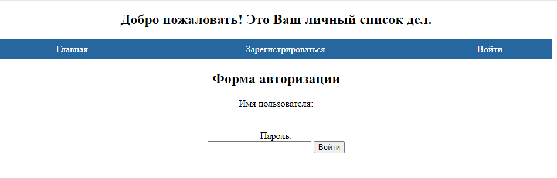
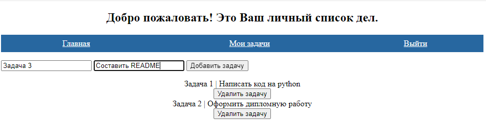

**Учебный проект к дипломной работе на тему:
"Анализ и сравнение написания web-приложений с использованием
разных фреймворков"**

Цель проекта - создание web-приложения для сравнения методов
написания бэкенд части с использованием фреймворков Django,
FastAPI и Flask.

Проект представляет собой TODO лист.
В приложении реализован простой функционал:
- регистрация и авторизация пользователя;
- формирование списка задач для конкретного авторизованного
пользователя;
- возможность удаления выполненных задач.

**Установка и начало работы:**
Для начала работы с приложением необходим установленный на ПК
python 3.12.
Список необходимых для работы приложения библиотек указан
в файле [requirements.txt](requirements.txt)
Для установки библиотек необходимо ввести в консоли команду:
pip install -r requirements.txt

Запуск локального сервера осуществляется для каждого фреймворка
в соотвтествии с документацией:
- https://www.djangoproject.com/ (Django)
- https://fastapi.tiangolo.com/ (FastAPI)
- https://flask.palletsprojects.com/en/stable/ (Flask)

**Код приложения и работа программы:**
Код приложения написан с помощью трех фреймворков. Код на django находится
в директории [Tasks_gjango](Tasks_gjango), код на FastAPI - в [Tasks_fastapi](Tasks_fastapi),
а код на Flask в директории [Tasks_flask](Tasks_flask).

Примеры работы приложения:
1. В приложении имеется главная страница

2. Предусмотрены формы регистрации и авторизации

3. Страница с задачами имеей форму для создания новой задачи, а так же возможность удаления
задач

